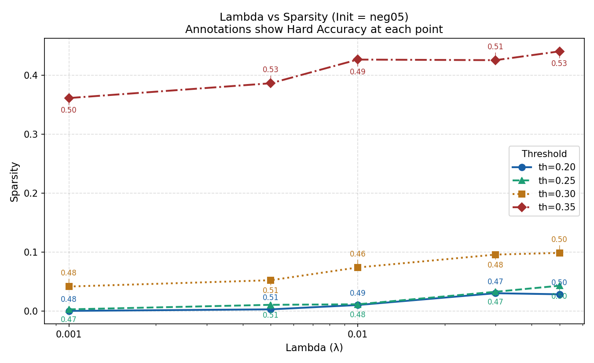
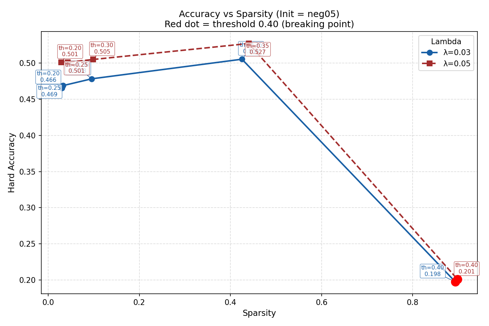
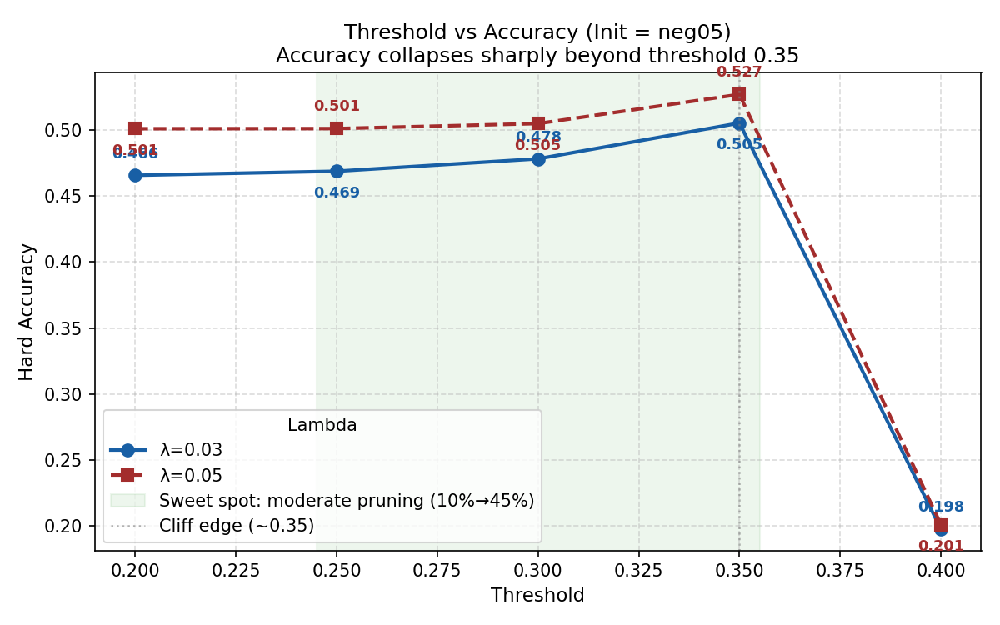
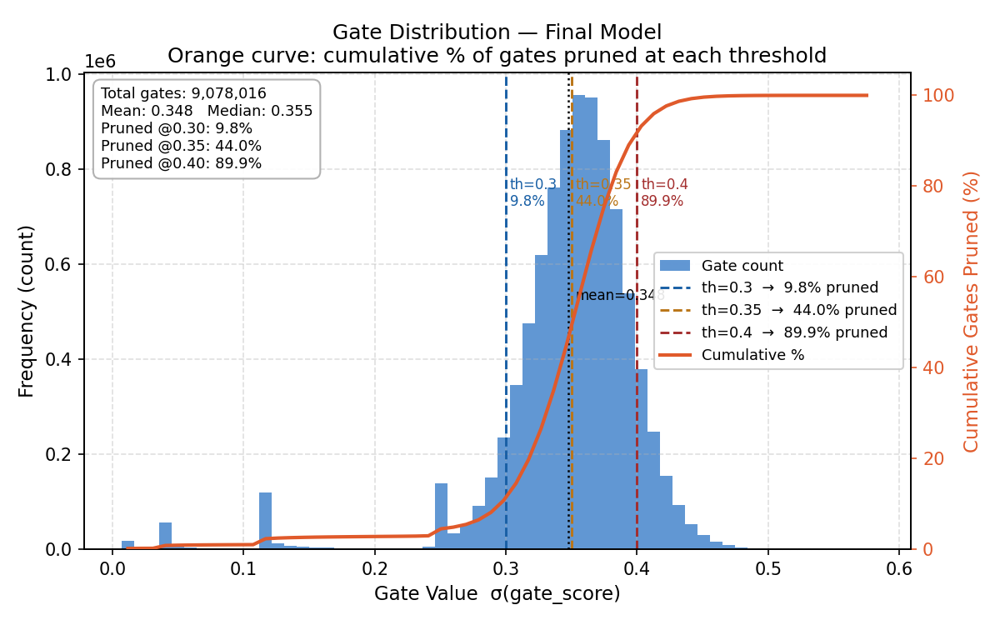

# Self-Pruning Neural Network with Learnable Gates

> A neural network that learns to prune itself during training using learnable sigmoid gates and L1 regularization — enabling sparsity-aware training and efficient model compression on CIFAR-10.

---

## Table of Contents

- [Problem Statement](#problem-statement)
- [Core Idea](#core-idea)
- [Architecture](#architecture)
- [How Sparsity is Learned](#how-sparsity-is-learned)
- [Hard Pruning at Evaluation](#hard-pruning-at-evaluation)
- [Project Structure](#project-structure)
- [Setup and Usage](#setup-and-usage)
- [Experiment Configuration](#experiment-configuration)
- [Results](#results)
- [Visualizations](#visualizations)
- [Key Observations](#key-observations)
- [Conclusion](#conclusion)

---

## Problem Statement

Deploying large neural networks in production is constrained by memory and compute budgets. Traditional pruning is a **post-training step** — weights are removed after the model has already converged. This project takes a different approach:

> **The network learns which of its own weights are unnecessary, and suppresses them automatically during training.**

The task is image classification on **CIFAR-10** using a feed-forward network augmented with a self-pruning mechanism based on learnable gate parameters.

---

## Core Idea

Each weight in the network is paired with a learnable **gate score**. The gate is passed through a sigmoid to produce a value between 0 and 1, and then multiplied element-wise with the weight:

```
Effective Weight = Weight × sigmoid(Gate Score)
```

| Gate Value | Meaning |
|---|---|
| → 0 | Weight is suppressed (pruned) |
| → 1 | Weight is active (important) |

This is called **Soft Pruning** — weights are not removed abruptly but gradually suppressed as training pushes their gates toward zero. Gradients flow through both the weight and the gate score simultaneously, so the model jointly learns what to keep and what to suppress.

---

## Architecture

### `PrunableLinear` — Custom Layer

```python
class PrunableLinear(nn.Module):
    def __init__(self, in_f, out_f, init_type="zero"):
        self.weight      = nn.Parameter(torch.randn(out_f, in_f) * 0.01)
        self.bias        = nn.Parameter(torch.zeros(out_f))
        self.gate_scores = nn.Parameter(torch.ones(out_f, in_f) * init_val)

    def forward(self, x):
        gates = torch.sigmoid(self.gate_scores)
        return F.linear(x, self.weight * gates, self.bias)
```

`gate_scores` is a full parameter tensor of the same shape as `weight`, registered with the optimizer so it is updated via backpropagation alongside the weights.

### Network (`Net`)

A 6-layer feed-forward network built entirely from `PrunableLinear` layers:

```
Input (3072) → 2048 → 1024 → 512 → 256 → 128 → 10 (Output)
```

ReLU activations between hidden layers; no activation on the final output (raw logits for cross-entropy).

**Total gate parameters:** ~9 million (one per weight).

---

## How Sparsity is Learned

The training loss has two components:

```
Total Loss = CrossEntropy(predictions, targets) + λ × SparsityLoss
```

**SparsityLoss** is the mean of all sigmoid gate values across every `PrunableLinear` layer:

```python
sparsity_loss = mean(sigmoid(gate_scores))   # averaged over all layers
```

### Why L1 on Sigmoid Gates Encourages Sparsity

The sigmoid gates are always positive, so the L1 norm is simply their sum. Minimizing this directly pushes gate values toward zero. Unlike L2 regularization (which pulls values toward zero but never exactly reaches it), **L1 penalizes all active gates equally regardless of magnitude** — this creates a hard incentive to fully suppress gates rather than merely shrinking them, which is why L1 is the standard choice for sparsity-inducing regularization.

### Role of λ (Lambda)

| λ | Effect |
|---|---|
| Low (0.001) | Network learns classification with minimal pruning |
| Medium (0.01) | Moderate sparsity, small accuracy trade-off |
| High (0.05) | Aggressive pruning, higher sparsity at moderate cost |

---

## Hard Pruning at Evaluation

Soft pruning does not reduce actual computation — the weights still exist in memory. To simulate real-world compression, a **threshold** is applied at evaluation time:

```python
mask = (sigmoid(gate_scores) > threshold).float()
output = F.linear(x, weight * mask, bias)
```

- Gates **below** the threshold → treated as zero (pruned)
- Gates **above** the threshold → kept active

> **Important:** The threshold is only used during evaluation. Training always uses the full soft gates.

**Sparsity level** is defined as the fraction of weights whose gate is below the threshold:

```python
sparsity = (gates < threshold).sum() / gates.numel()
```

---

## Project Structure

```
TREDENCE_ASSIGNMENT/
├── soft_pruning_with_gates.py   # Full implementation: model, training, evaluation, plots
├── requirements.txt             # Python dependencies
├── results/
│   ├── results.csv              # All experiment logs (50 rows: 2 inits × 5 lambdas × 5 thresholds)
│   └── plots/
│       ├── lambda_vs_sparsity.png
│       ├── accuracy_vs_sparsity.png
│       ├── threshold_vs_accuracy.png
│       └── gate_distribution.png
└── data/
    └── cifar-10-batches-py/     # Auto-downloaded by torchvision
```

---

## Setup and Usage

### Requirements

```
torch>=2.0.0
torchvision>=0.15.0
matplotlib>=3.7.0
numpy>=1.24.0
```

### Install

```bash
pip install -r requirements.txt
```

### Run

```bash
python soft_pruning_with_gates.py
```

The script will:
1. Download CIFAR-10 automatically (into `./data/`) on first run
2. Train models across all lambda × initialization combinations (20 epochs each)
3. Evaluate at every threshold
4. Save `results/results.csv` and all 4 plots to `results/plots/`

> **Note:** Running the full experiment grid (10 model configs × 5 thresholds = 50 evaluations) takes significant time. GPU training is used automatically if CUDA is available (`torch.cuda.is_available()`).

---

## Experiment Configuration

| Parameter | Values Tested |
|---|---|
| Lambda (λ) | 0.001, 0.005, 0.01, 0.03, 0.05 |
| Threshold | 0.20, 0.25, 0.30, 0.35, 0.40 |
| Gate Initialization | `zero` (0.0), `neg05` (−0.5) |
| Epochs | 20 |
| Optimizer | Adam (lr = 1e-3) |
| Batch Size | 128 |
| Dataset | CIFAR-10 (50k train / 10k test) |

**Gate Initialization:**
- `zero`: `sigmoid(0) = 0.5` — gates start neutral
- `neg05`: `sigmoid(−0.5) ≈ 0.38` — gates start biased toward pruning, giving the L1 regularization a head start

---

## Results

All results below use **`init = neg05`**, which consistently outperformed `zero` initialization.

### Summary Table — Hard Accuracy & Sparsity (Init = neg05)

| λ | Threshold | Soft Acc | Hard Acc | Sparsity |
|---|---|---|---|---|
| 0.001 | 0.30 | 54.10% | 47.78% | 4.14% |
| 0.001 | 0.35 | 54.10% | 50.16% | 36.10% |
| 0.005 | 0.30 | 54.93% | 50.98% | 5.21% |
| 0.005 | 0.35 | 54.93% | **52.75%** | 38.61% |
| 0.010 | 0.30 | 55.18% | 45.64% | 7.37% |
| 0.010 | 0.35 | 55.18% | 48.85% | 42.63% |
| 0.030 | 0.30 | 54.35% | 47.82% | 9.56% |
| 0.030 | 0.35 | 54.35% | 50.53% | 42.53% |
| **0.050** | **0.35** | **54.59%** | **52.70%** | **44.02%** |
| 0.050 | 0.40 | 54.59% | 20.09% | **89.87%** |

**Bold** row = best practical configuration: λ=0.05, threshold=0.35 retains ~52.7% accuracy while pruning **44% of all weights**.

### Sparsity vs. Accuracy at Threshold = 0.40 (Breaking Point)

| λ | Hard Acc | Sparsity |
|---|---|---|
| 0.001 | 23.28% | 87.91% |
| 0.005 | 23.68% | 88.38% |
| 0.010 | 25.20% | 89.25% |
| 0.030 | 19.75% | 89.37% |
| 0.050 | 20.09% | 89.87% |

At threshold = 0.40, ~90% of weights are pruned but accuracy collapses to near-random (10 classes → ~10%). This defines the **breaking point** of the pruning mechanism.

---

## Visualizations

### Plot 1 — Lambda vs Sparsity


Shows how increasing λ drives higher sparsity at every threshold level. The `neg05` initialization amplifies this effect. Annotations on each point show the corresponding hard accuracy, making the λ–sparsity–accuracy three-way relationship visible in a single chart.

---

### Plot 2 — Accuracy vs Sparsity (Main Trade-off Plot)


The primary result chart. Each point is a (λ, threshold) pair. For both λ=0.03 and λ=0.05:
- Accuracy stays above **~50%** for sparsity up to ~45%
- Beyond threshold=0.35, sparsity jumps to ~90% and accuracy collapses (red dots)

This confirms the model learns meaningful gate structure — it is not pruning randomly.

---

### Plot 3 — Threshold vs Accuracy (Sensitivity Analysis)


The green shaded region (threshold 0.25–0.35) is the **sweet spot**: sparsity rises from ~10% to ~44% while accuracy remains competitive. Beyond 0.35, there is a sharp cliff — both λ curves lose more than 30 percentage points of accuracy within a single threshold step.

---

### Plot 4 — Gate Distribution (Final Model)


Histogram of all 9M+ sigmoid gate values from the final trained model, with a cumulative pruning curve overlaid on the right axis.

Key statistics:
- **Mean gate: ~0.348** — the bulk of gates cluster between 0.30 and 0.45
- **~9.8% of gates below 0.30** (pruned at th=0.30)
- **~44.0% of gates below 0.35** (pruned at th=0.35)
- **~89.9% of gates below 0.40** (pruned at th=0.40)

The distribution is unimodal and concentrated just above 0.30, which means the L1 regularization successfully pushed gate values down — but not all the way to zero, creating the observed threshold-sensitivity behavior.

---

## Key Observations

**1. Initialization matters.**
`neg05` consistently produces better sparsity than `zero` at the same λ. Starting gates at `sigmoid(−0.5) ≈ 0.38` gives L1 regularization a head start pushing gates toward zero.

**2. λ controls pruning strength.**
Higher λ → more sparsity, but with diminishing accuracy returns. The λ=0.03–0.05 range is the practical sweet spot for this architecture.

**3. Threshold 0.35 is the optimal evaluation cutoff.**
At threshold=0.35, sparsity is ~40–44% with hard accuracy still above 50%. One step higher (0.40) and ~90% of weights are pruned, causing near-total accuracy collapse.

**4. Soft accuracy ≠ Hard accuracy.**
Soft accuracy (using full gates) stays around 54–55% across all configurations. Hard accuracy (after threshold masking) varies dramatically — this gap reveals how much the model depends on low-gate weights that soft pruning never fully eliminates.

**5. The network learns structure, not noise.**
If pruning were random, accuracy would degrade smoothly with sparsity. The observed behavior — stable accuracy up to 44% sparsity, then a sharp cliff — shows the gates have learned a meaningful importance ranking of weights.

---

## Conclusion

This project demonstrates a fully differentiable self-pruning mechanism:

- The `PrunableLinear` layer correctly gates every weight via a learnable sigmoid parameter with full gradient flow through both `weight` and `gate_scores`
- L1 regularization on sigmoid gates successfully drives sparsity during training
- At the best configuration (λ=0.05, threshold=0.35, init=neg05), the model achieves **~44% sparsity while retaining ~52.7% accuracy** on CIFAR-10 — compared to a soft (unpruned) accuracy of ~54.6%
- The gate distribution and threshold sensitivity plots confirm that pruning is structured and interpretable, not arbitrary

The primary accuracy ceiling (~55%) reflects the inherent limitation of a fully connected network on CIFAR-10 (CNNs are much better suited for image data). The self-pruning mechanism itself works as designed.
